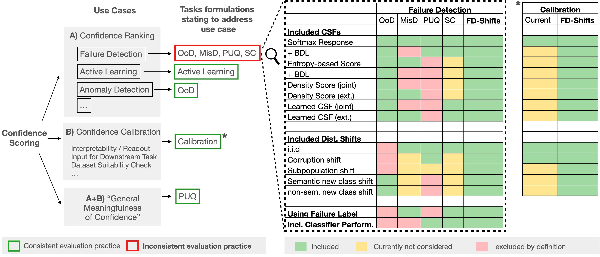

<!-- # FD-Shifts -->
<p align="center">
    
    <br/>
</p>

<p align="center">
    
    <a href="https://github.com/IML-DKFZ/fd-shifts/blob/main/LICENSE">
    
    </a>
    <a href="https://github.com/IML-DKFZ/fd-shifts/releases">
        
    </a>
    <a href="https://zenodo.org/badge/latestdoi/570145779"></a>
</p>

---

> Reliable application of machine learning-based decision systems in the wild is
> one of the major challenges currently investigated by the field. A large
> portion of established approaches aims to detect erroneous predictions by
> means of assigning confidence scores. This confidence may be obtained by
> either quantifying the model's predictive uncertainty, learning explicit
> scoring functions, or assessing whether the input is in line with the training
> distribution. Curiously, while these approaches all state to address the same
> eventual goal of detecting failures of a classifier upon real-life
> application, they currently constitute largely separated research fields with
> individual evaluation protocols, which either exclude a substantial part of
> relevant methods or ignore large parts of relevant failure sources. In this
> work, we systematically reveal current pitfalls caused by these
> inconsistencies and derive requirements for a holistic and realistic
> evaluation of failure detection. To demonstrate the relevance of this unified
> perspective, we present a large-scale empirical study for the first time
> enabling benchmarking confidence scoring functions w.r.t all relevant methods
> and failure sources. The revelation of a simple softmax response baseline as
> the overall best performing method underlines the drastic shortcomings of
> current evaluation in the abundance of publicized research on confidence
> scoring.

<p align="center">
    <figure class="image">
        
        <figcaption style="font-size: small;">
        Holistic perspective on failure detection. Detecting failures should be seen in the
        context of the overarching goal of preventing silent failures of a classifier, which includes two tasks:
        preventing failures in the first place as measured by the "robustness" of a classifier (Task 1), and
        detecting the non-prevented failures by means of CSFs (Task 2, focus of this work). For failure
        prevention across distribution shifts, a consistent task formulation exists (featuring accuracy as the
        primary evaluation metric) and various benchmarks have been released covering a large variety of
        realistic shifts (e.g. image corruption shifts, sub-class shifts, or domain shifts). In contrast, progress in
        the subsequent task of detecting the non-prevented failures by means of CSFs is currently obstructed
        by three pitfalls: 1) A diverse and inconsistent set of evaluation protocols for CSFs exists (MisD, SC,
        PUQ, OoD-D) impeding comprehensive competition. 2) Only a fraction of the spectrum of realistic
        distribution shifts and thus potential failure sources is covered diminishing the practical relevance
        of evaluation. 3) The task formulation in OoD-D fundamentally deviates from the stated purpose
        of detecting classification failures. Overall, the holistic perspective on failure detection reveals an
        obvious need for a unified and comprehensive evaluation protocol, in analogy to current robustness
        benchmarks, to make classifiers fit for safety-critical applications. Abbreviations: CSF: Confidence
        Scoring Function, OoD-D: Out-of-Distribution Detection, MisD: Misclassification Detection, PUQ:
        Predictive Uncertainty Quantification, SC: Selective Classification
        </figcaption>
    </figure>
</p>

## Citing This Work

If you use fd-shifts please cite our [paper](https://openreview.net/pdf?id=YnkGMIh0gvX)

```bibtex
@inproceedings{
    jaeger2023a,
    title={A Call to Reflect on Evaluation Practices for Failure Detection in Image Classification},
    author={Paul F Jaeger and Carsten Tim L{\"u}th and Lukas Klein and Till J. Bungert},
    booktitle={International Conference on Learning Representations},
    year={2023},
    url={https://openreview.net/forum?id=YnkGMIh0gvX}
}
```

> **Note**  
> This repository also contains the benchmarks for our follow-up study ["Understanding Silent Failures in Medical Image Classification"](https://arxiv.org/abs/2307.14729). For the visualization tool presented in that work please see [sf-visuals](https://github.com/IML-DKFZ/sf-visuals).

## Table Of Contents

<!--toc:start-->

- [Installation](#installation)
- [How to Integrate Your Own Usecase](#how-to-integrate-your-own-usecase)
- [Reproducing our results](#reproducing-our-results)
  - [Data Folder Requirements](#data-folder-requirements)
  - [Training](#training)
  - [Model Weights](#model-weights)
  - [Inference](#inference)
  - [Analysis](#analysis)
- [Acknowledgements](#acknowledgements)

<!--toc:end-->

## Installation

**FD-Shifts requires Python version 3.10 or later.** It is recommended to
install FD-Shifts in its own environment (venv, conda environment, ...).

1. **Install an appropriate version of [PyTorch](https://pytorch.org/).** Check
   that CUDA is available and that the CUDA toolkit version is compatible with
   your hardware. The currently necessary version of
   [pytorch is v.1.11.0](https://pytorch.org/get-started/previous-versions/#v1110).
   Testing and Development was done with the pytorch version using CUDA 11.3.

2. **Install FD-Shifts.** This will pull in all dependencies including some
   version of PyTorch, it is strongly recommended that you install a compatible
   version of PyTorch beforehand. This will also make the `fd_shifts` cli
   available to you.
   ```bash
   pip install git+https://github.com/iml-dkfz/fd-shifts.git
   ```

## How to Integrate Your Own Usecase

To learn about extending FD-Shifts with your own models, datasets and confidence
scoring functions check out the
[tutorial on extending FD-Shifts](./docs/extending_fd-shifts.ipynb)
[](https://colab.research.google.com/github/iml-dkfz/fd-shifts/blob/main/docs/extending_fd-shifts.ipynb).

## Reproducing our results

To use `fd_shifts` you need to set the following environment variables

```bash
export EXPERIMENT_ROOT_DIR=/absolute/path/to/your/experiments
export DATASET_ROOT_DIR=/absolute/path/to/datasets
```

Alternatively, you may write them to a file and source that before running
`fd_shifts`, e.g.

```bash
mv example.env .env
```

Then edit `.env` to your needs and run

```bash
source .env
```

### Data Folder Requirements

For the predefined experiments we expect the data to be in the following folder
structure relative to the folder you set for `$DATASET_ROOT_DIR`.

```
<$DATASET_ROOT_DIR>
├── breeds
│   └── ILSVRC ⇒ ../imagenet/ILSVRC
├── imagenet
│   ├── ILSVRC
├── cifar10
├── cifar100
├── corrupt_cifar10
├── corrupt_cifar100
├── svhn
├── tinyimagenet
├── tinyimagenet_resize
├── wilds_animals
│   └── iwildcam_v2.0
└── wilds_camelyon
    └── camelyon17_v1.0
```

For information regarding where to download these datasets from and what you have to do with them please check out [the documentation](./docs/datasets.md).

### Training

To get a list of all fully qualified names for all experiments in the paper, use

```bash
fd_shifts list
```

You can reproduce the results of the paper either all at once:

```bash
fd_shifts launch
```

Some at a time:

```bash
fd_shifts launch --model=devries --dataset=cifar10
```

Or one at a time (use `fd_shifts list` to find the names of experiments):

```bash
fd_shifts launch --name=fd-shifts/svhn_paper_sweep/devries_bbsvhn_small_conv_do1_run1_rew2.2
```

Check out `fd_shifts launch --help` for more filtering options.

### Model Weights

All pretrained model weights used for the benchmark can be found on Zenodo under the following links:

- [iWildCam-2020-Wilds](https://zenodo.org/record/7620946)
- [iWildCam-2020-Wilds (OpenSet Training)](https://zenodo.org/record/7621150)
- [BREEDS-ENTITY-13](https://zenodo.org/record/7621249)
- [CAMELYON-17-Wilds](https://zenodo.org/record/7621456)
- [CIFAR-100](https://zenodo.org/record/7622086)
- [CIFAR-100 (superclasses)](https://zenodo.org/record/7622116)
- [CIFAR-10](https://zenodo.org/record/7622047)
- [SVHN](https://zenodo.org/record/7622152)
- [SVHN (OpenSet Training)](https://zenodo.org/record/7622177)

### Inference

To run inference for one of the experiments, append `--mode=test` to any of the
commands above.

### Analysis

To run analysis for some of the predefined experiments, set `--mode=analysis` in
any of the commands above.

To run analysis over an already available set of model outputs the outputs have
to be in the following format:

For a classifier with `d` outputs and `N` samples in total (over all tested
datasets) and for `M` dropout samples

```
raw_logits.npz
Nx(d+2)

  0, 1, ...                 d─1,   d,      d+1
┌───────────────────────────────┬───────┬─────────────┐
|           logits_1            | label | dataset_idx |
├───────────────────────────────┼───────┼─────────────┤
|           logits_2            | label | dataset_idx |
├───────────────────────────────┼───────┼─────────────┤
|           logits_3            | label | dataset_idx |
└───────────────────────────────┴───────┴─────────────┘
.
.
.
┌───────────────────────────────┬───────┬─────────────┐
|           logits_N            | label | dataset_idx |
└───────────────────────────────┴───────┴─────────────┘
```

```
external_confids.npz
Nx1
```

```
raw_logits_dist.npz
NxdxM

  0, 1, ...                  d─1
┌───────────────────────────────┐
|   logits_1 (Dropout Sample 1) |
|   logits_1 (Dropout Sample 2) |
|               .               |
|               .               |
|               .               |
|   logits_1 (Dropout Sample M) |
├───────────────────────────────┤
|   logits_2 (Dropout Sample 1) |
|   logits_2 (Dropout Sample 2) |
|               .               |
|               .               |
|               .               |
|   logits_2 (Dropout Sample M) |
├───────────────────────────────┤
|   logits_3 (Dropout Sample 1) |
|   logits_3 (Dropout Sample 2) |
|               .               |
|               .               |
|               .               |
|   logits_3 (Dropout Sample M) |
└───────────────────────────────┘
                .
                .
                .
┌───────────────────────────────┐
|   logits_N (Dropout Sample 1) |
|   logits_N (Dropout Sample 2) |
|               .               |
|               .               |
|               .               |
|   logits_N (Dropout Sample M) |
└───────────────────────────────┘
```

```
external_confids_dist.npz
NxM
```

You may also use the `ExperimentData` class to load your data in another way.
You also have to provide an adequate config, where all test datasets and query
parameters are set. Check out the config files in `fd_shifts/configs` including
the dataclasses. Importantly, the `dataset_idx` has to match up with the list of
datasets you provide and whether or not `val_tuning` is set. If `val_tuning` is
set, the validation set takes over `dataset_idx=0`.

## Acknowledgements

<br>

<p align="center">
   &nbsp;&nbsp;&nbsp;&nbsp;
   &nbsp;&nbsp;&nbsp;&nbsp;
  
</p>
