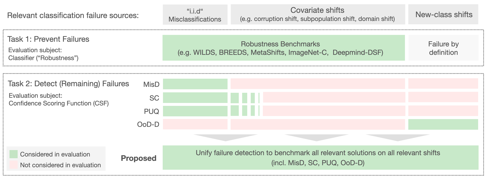

# FD-Shifts



If you use fd-shifts please cite our [paper]()

```

```

## Installation

1. Clone the repository

```bash
git clone https://github.com/iml-dkfz/failure-detection-benchmark
```

2. Install the package

```bash
cd failure-detection-benchmark
pip install .
```

## Usage

To use `fd_shifts` you need to set the following environment variables
```bash
export EXPERIMENT_ROOT_DIR=path/to/your/experiments
export DATASET_ROOT_DIR=path/to/datasets
```

### Training

You can reproduce the results of the paper using the installed commands. To
train all non-ViT networks and run all tests and analysis for dataset `<dataset>` run

```bash
fd_shifts-<dataset>
```

To train and run all ViT experiments run
```bash
fd_shifts-vit
```

### Configurations

If you want to change values take a look at the study configurations in
`fd_shifts/configs/study`. You might be interested in running a single study
(either one of the available ones or one you added to the folder). For that you
can run for example
```bash
fd_shifts study=devries data=cifar10_data trainer.optimizer.learning_rate=1e-5
```
and overwrite all config parameters via command-line parameters.

### Analysis

To run analysis over an already available set of model outputs the outputs have to be in the following format:

For a classifier with `d` outputs and `N` samples in total (over all tested datasets)
```
raw_output.npz

  0, 1, ...                 d-1,   d,      d+1
--------------------------------------------------------
|           softmax_1            | label | dataset_idx |
--------------------------------------------------------
|           softmax_2            | label | dataset_idx |
--------------------------------------------------------
|           softmax_3            | label | dataset_idx |
--------------------------------------------------------
.
.
.
--------------------------------------------------------
|           softmax_N            | label | dataset_idx |
--------------------------------------------------------
```

You may also use the `ExperimentData` class to load your data in another way.
You also have to provide an adequate config, where all test datasets and query
parameters are set.

## Acknowledgements
