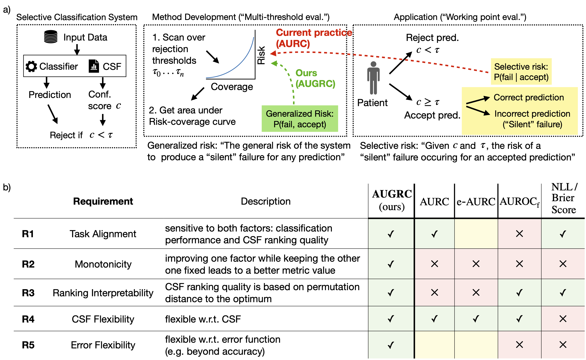

# [Overcoming Common Flaws in the Evaluation of Selective Classification Systems](https://arxiv.org/abs/2407.01032)
For installation and general usage, follow the [FD-Shifts instructions](../../README.md).

## Using the AUGRC in your work
In [rc_stats.py](../../fd_shifts/analysis/rc_stats.py), we provide the standalone `RiskCoverageStats` class for evaluating metrics related to Risk-Coverage curves, including an implementation of the AUGRC.

To evaluate the AUGRC for your SC model predictions:
```python
from fd_shifts.analysis.rc_stats import RiskCoverageStats
augrc = RiskCoverageStats(confids=my_confids, residuals=my_loss_values).augrc
```

## Citing this Work
```bibtex
@article{traub2024overcoming,
  title={Overcoming Common Flaws in the Evaluation of Selective Classification Systems},
  author={Traub, Jeremias and Bungert, Till J and L{\"u}th, Carsten T and Baumgartner, Michael and Maier-Hein, Klaus H and Maier-Hein, Lena and Jaeger, Paul F},
  journal={arXiv preprint arXiv:2407.01032},
  year={2024}
}
```

## Abstract
> Selective Classification, wherein models can reject low-confidence predictions, promises reliable translation of machine-learning based classification systems to real-world scenarios such as clinical diagnostics. While current evaluation of these systems typically assumes fixed working points based on pre-defined rejection thresholds, methodological progress requires benchmarking the general performance of systems akin to the AUROC in standard classification. In this work, we define 5 requirements for multi-threshold metrics in selective classification regarding task alignment, interpretability, and flexibility, and show how current approaches fail to meet them. We propose the Area under the Generalized Risk Coverage curve (AUGRC), which meets all requirements and can be directly interpreted as the average risk of undetected failures. We empirically demonstrate the relevance of AUGRC on a comprehensive benchmark spanning 6 data sets and 13 confidence scoring functions. We find that the proposed metric substantially changes metric rankings on 5 out of the 6 data sets.

<p align="center">
    <figure class="image">
        
        <figcaption style="font-size: small;">
        The AUGRC metric based on Generalized Risk overcomes common flaws in current evaluation of Selective classification (SC). a) Refined task definition for SC. Analogously to standard classification, we distinguish between holistic evaluation for method development and benchmarking using multi-threshold metrics versus evaluation of specific application scenarios at pre-determined working points. The current most prevalent multi-threshold metric in SC, AURC, is based on Selective Risk, a concept for working point evaluation that is not suitable for aggregation over rejection thresholds (red arrow). To fill this gap, we formulate the new concept of Generalized Risk and a corresponding metric, AUGRC (green arrow). b) We formalize our perspective on SC evaluation by identifying five key requirements for multi-threshold metrics and analyze how previous metrics fail to fulfill them. Abbreviations, CSF: Confidence Scoring Function.
        </figcaption>
    </figure>
</p>

## Data Folder Requirements

For the predefined experiments we expect the data to be in the following folder
structure relative to the folder you set for `$DATASET_ROOT_DIR`.

```
<$DATASET_ROOT_DIR>
├── breeds
│   └── ILSVRC ⇒ ../imagenet/ILSVRC
├── imagenet
│   ├── ILSVRC
├── cifar10
├── cifar100
├── corrupt_cifar10
├── corrupt_cifar100
├── svhn
├── tinyimagenet
├── tinyimagenet_resize
├── wilds_animals
│   └── iwildcam_v2.0
└── wilds_camelyon
    └── camelyon17_v1.0
```

For information regarding where to download these datasets from and what you have to do with them please check out the [dataset documentation](../datasets.md).

## Training & Analysis

To get a list of all fully qualified names for all experiments in the paper, use

```bash
fd-shifts list-experiments --custom-filter=augrc2024
```

To reproduce all results of the paper:

```bash
fd-shifts launch --mode=train --custom-filter=augrc2024
fd-shifts launch --mode=test --custom-filter=augrc2024
fd-shifts launch --mode=analysis --custom-filter=augrc2024
```

```bash
python scripts/analysis_bootstrap.py --custom-filter=augrc2024
```

### Model Weights

All pretrained model weights used for the benchmark can be found on Zenodo under the following links:

- [iWildCam-2020-Wilds](https://zenodo.org/record/7620946)
- [iWildCam-2020-Wilds (OpenSet Training)](https://zenodo.org/record/7621150)
- [BREEDS-ENTITY-13](https://zenodo.org/record/7621249)
- [CAMELYON-17-Wilds](https://zenodo.org/record/7621456)
- [CIFAR-100](https://zenodo.org/record/7622086)
- [CIFAR-100 (superclasses)](https://zenodo.org/record/7622116)
- [CIFAR-10](https://zenodo.org/record/7622047)
- [SVHN](https://zenodo.org/record/7622152)
- [SVHN (OpenSet Training)](https://zenodo.org/record/7622177)

### Create results tables

```bash
fd-shifts report
fd-shifts report_bootstrap
```
