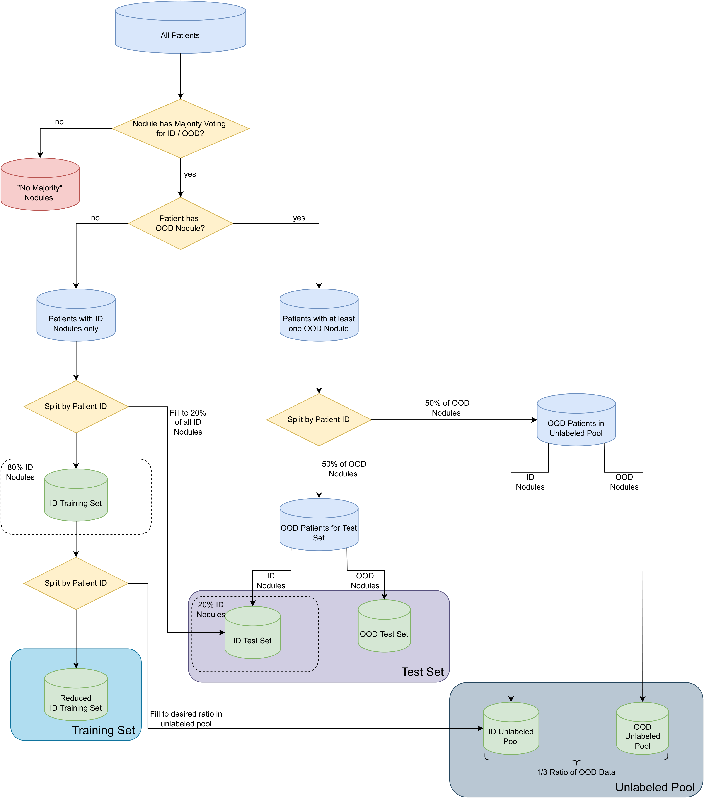

# Processing the LIDC-IDRI dataset
This folder contains the necessary code to retrieve the LIDC-IDRI dataset, a dataset of lung nodules, as we used it 
in our experiments. This will generate a cropped version of the nodules of size 64x64x64 as .nii.gz (nifti) files.

## Setup

First, you need to download the original image data of the LIDC-IDRI dataset according to the 
[Cancer Imaging Archive](https://wiki.cancerimagingarchive.net/pages/viewpage.action?pageId=1966254).
Next, the data can be preprocessed using [pylidc](https://pylidc.github.io). Note, that unfortunately this library
requires an older version of numpy, which is why you should probably do the processing of the LIDC-IDRI data in a
separate virtual environment. We provide the requirements_lidc.txt file in this folder to install all the necessary
dependencies in this virtual environment. Simply run

```
pip install -r requirements_lidc.txt
```

In your separate virtual environment to install the necessary requirements.

Furthermore, you should provide the .pylidcrc file as described in the
[setup instructions of the pylidc package](https://pylidc.github.io/install.html).

## Create dataset with cropped nodules

To create the dataset that we used to get our experimental results, with cropped nodules of size 64x64x64, run 

```
python save_cropped_nodules.py -s <path to save dir>
```

This will create the subfolders images and labels with the corresponding cropped nodules and annotations in them.
Furthermore, the metadata for each nodule will be stored in a csv file (metadata.csv)

## Determine i.i.d and OoD nodules

For the subsequent analysis steps, especially for splitting the patients into training and testing data, it is
important to know whether a nodule is rated as i.i.d or OoD w.r.t. a specific metadata feature. This information is 
summarized in a csv file (id_ood.csv). To create this csv file (necessary for later steps), run 

```
python id_ood.py -d <path to cropped nodules>
```

## Generating split files for first training cycle

Generating the datatset splits into training and testing is special for the LIDC-IDRI dataset, since the i.i.d. and OoD
information of the nodules have to be considered (see [this section](#Determine i.i.d and OoD nodules) for how to 
create the csv file in the appropriate format). Furthermore, it has to be ensured that no patient is in the training
and test dataset at the same time. To create a split file for the initial training cycle that also includes an unlabeled
pool for active learning experiments, run

```
python splits_first_cycle.py -d <path to cropped nodules> -f <metadata feature for splitting, e.g. malignancy>
```

or 

```
python splits_first_cycle.py -s <path to store splits> --id_ood_csv <path to csv with i.i.d. and OoD information> -f <metadata feature for splitting, e.g. malignancy>
```

As features for splitting, we used texture and malignancy. Here you can see a diagram how the splits are created:



## Preprocess the data

To preprocess the data, i.e. normalize the images and save them as numpy arrays for the input for later training, 
you can use the preprocess_datasets_3d script in the datasets folder of this repository. To execute the script, run

```
cd ..
python preprocess_datasets_3d.py -d <base path to cropped nodules and labels> -r 4 --dataset lidc
```
